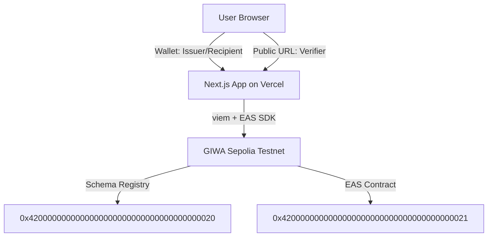

# Dojang Diploma 🎓

> On-chain verifiable diploma platform on GIWA Sepolia Testnet, leveraging Ethereum Attestation Service (EAS).

[](https://nextjs.org/)
[](https://www.typescriptlang.org/)
[](https://docs.giwa.io)
[](https://attest.sh)

---

## Deployed Live Demo
🔗 **Vercel Deployment**: [will fill after deploy]

---

## The Problem
Academically rigorous coding bootcamps in South Korea output thousands of job-seeking developers each year. However, verifying paper or PDF diplomas during recruiting processes remains a slow, manual, and easily forged task. Fake academic credentials undermine the reputation of legitimate bootcamps and increase hiring risks for companies.

## The Solution
Dojang Diploma solves this by issuing tamper-proof, academically rigorous certificates as on-chain attestations using the Ethereum Attestation Service (EAS) directly on the GIWA Sepolia Testnet. Employers can instantly verify any graduate's diploma with a single click or QR code scan, querying the immutable blockchain state directly with zero fee.

## Why GIWA Blockchain?
*   **Sub-1s Transaction Finality**: Powered by GIWA Flashblocks, batch diploma issuing takes less than a second to confirm on-chain.
*   **Unified Attestation Layer**: Built on the exact same EAS contract registry as GIWA's official Dojang service, offering natural interoperability.
*   **Read-Only Public Audits**: Verification is 100% read-only and public, meaning recruiters do not need a Web3 wallet or gas to verify authenticity.
*   **GIWA Wallet Interoperability**: Seamlessly positions itself to display diplomas directly under the "Attestations" tab of the native GIWA Wallet.

---

## Architecture



---

## Tech Stack

| Tool | Version | Description |
| :--- | :--- | :--- |
| **Next.js** | `14.2.35` | React framework with App Router support |
| **TypeScript** | `5.x` | Strongly typed Javascript dialect |
| **Wagmi & RainbowKit** | `v3` / `v2` | Wallet connection and hook integrations |
| **Viem** | `2.x` | Lightweight library for Ethereum RPC queries |
| **next-intl** | `4.13.2` | App-Router locale negotiation and translations |
| **papaparse** | `5.5.4` | High-fidelity CSV client-side parser |
| **qrcode.react** | `4.2.0` | SVG-based QR code generator |
| **Tailwind CSS** | `3.4.1` | Premium dark Claymorphism visual design styling |

---

## Deployed Addresses & IDs

*   **GIWA Sepolia Chain ID**: `91342`
*   **EAS Contract Address**: `0x4200000000000000000000000000000000000021`
*   **Schema Registry Address**: `0x4200000000000000000000000000000000000020`
*   **Diploma Schema UID**: `0x71aa0569cb3cc3d3ac10219df4610359fbdacedb485ba1d0eee2bcb137102c39`
    *   *Schema Definition*: `string studentName, string courseName, uint64 completionDate, string issuerName`

---

## Visuals & Screenshots

### 1. Landing Dashboard

*Modern cosmic-dark dashboard displaying project flow.*

### 2. Issue Form (Single & CSV Batch tabs)

*Authorized issuers can choose between entering single student details or batch-minting via CSV.*

### 3. Public Verification Card with QR Code

*Recruiter-facing verifiable card showing valid status, cryptographic signatures, and scan-to-verify QR code.*

### 4. My Diplomas Portal (English & Korean layouts)

*Personal credential portal showing student's diplomas with instant EN / KO locale translation.*

---

## Roadmap

### v0 (Hackathon Release)
*   [x] Project setup with Next.js, Wagmi, and Viem
*   [x] Deterministic EAS schema registration on GIWA Sepolia
*   [x] Core helper encoders and decoders for diploma schemas
*   [x] Wallet connection and single attestation issuing

### v1 (Current Features)
*   [x] **Batch Issue via CSV**: Parse CSV and call `multiAttest` in one transaction
*   [x] **Offline Verification QR Code**: Share-to-verify QR rendering
*   [x] **i18n Localization**: Fully translated interface (English & Korean)

### v2 (Post-GASOK Selection Pilot)
*   [ ] Partner with 1-2 Korean bootcamps for active certificate pilots
*   [ ] Register as an official attester on GIWA Dojang registry
*   [ ] Add email notifications to graduates with claiming links

### v3 (Next steps)
*   [ ] **GIWA Wallet Native Tab**: Attestations appear automatically in GIWA Wallet
*   [ ] **Reputation Scores**: Aggregate multiple diplomas to output developer reputation profiles

---

## Local Setup

1.  **Clone the repository**
2.  **Install dependencies**:
    ```bash
    pnpm install
    ```
3.  **Configure environment**:
    Copy the template variables file:
    ```bash
    cp .env.local.example .env.local
    ```
    Open `.env.local` and configure your credentials:
    - Set `NEXT_PUBLIC_WALLETCONNECT_PROJECT_ID`
    - Set `DEPLOYER_PRIVATE_KEY` for schema registrations
4.  **Register Schema** (first time only, if using a new registry):
    ```bash
    pnpm register-schema
    ```
5.  **Run locally**:
    ```bash
    pnpm dev
    ```
    Navigate to `http://localhost:3000`.

---

## Deploy to Vercel

1.  Create a new project on Vercel.
2.  Import your GitHub repository.
3.  Add all environment variables from `.env.local.example` (ensure you do **NOT** add the `DEPLOYER_PRIVATE_KEY` to Vercel for security).
4.  Click **Deploy**. Vercel will build the application using the configuration in `next.config.mjs` automatically.

---

## License
Distributed under the MIT License. See `LICENSE` for details.
